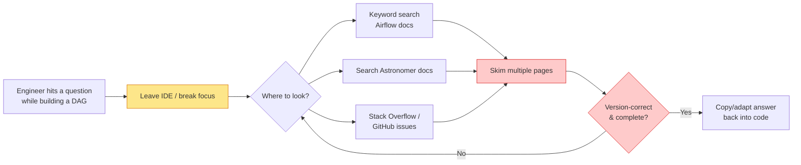
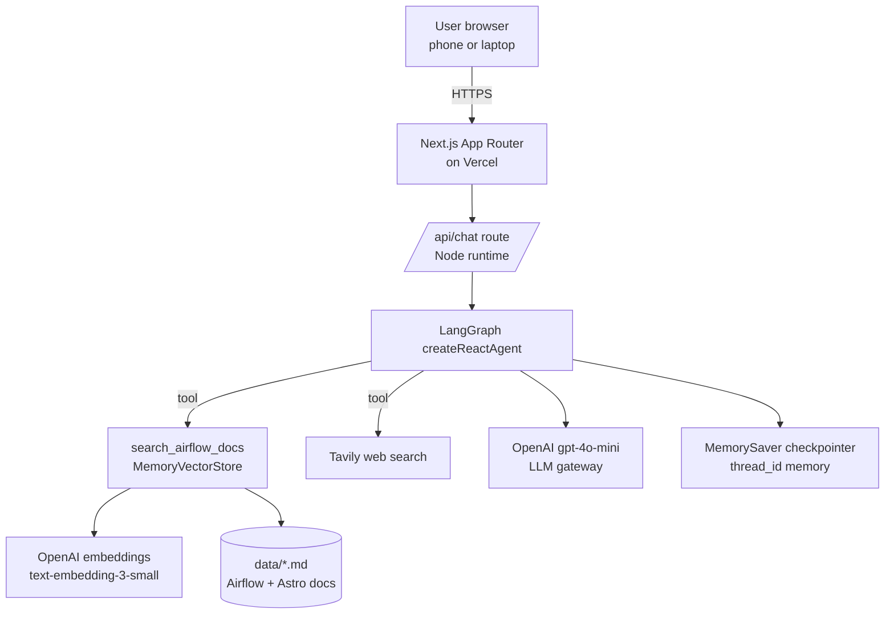
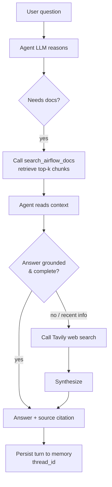

# Certification Challenge Submission — Airflow Docs Copilot

**Project:** Airflow Docs Copilot — an Agentic RAG assistant for Apache Airflow & Astronomer users.
**Repo:** `00_Docs/Certification Challenge/app`
**Live demo:** https://aie10challenge.vercel.app/
**Loom video:** https://www.loom.com/share/11e5a8a1be604c269b50c28f2e5d7237

---

## Task 1: Problem, Audience, and Scope

### 1. Problem (one sentence)
Data engineers waste significant time hunting across sprawling Apache Airflow and Astronomer documentation to answer routine "how do I" questions while building and operating data pipelines.

### 2. Why this is a problem
**Who:** Data engineers and analytics engineers (job titles like *Data Engineer*, *Analytics Engineer*, *Platform/DataOps Engineer*) who author and operate Airflow DAGs day to day. The function being automated is *documentation lookup and troubleshooting* during pipeline development.

**What they're trying to do:** Answer concrete, recurring questions — "How do I set a task dependency?", "Why isn't my DAG running?", "How do I change the webserver port with the Astro CLI?", "Which executor isolates each task?" — without breaking flow.

**How they handle it today:** They alt-tab to a browser, keyword-search the Airflow docs and Astronomer docs, skim several pages, cross-check Stack Overflow / GitHub issues for version-specific behavior, and stitch together an answer. The docs are large, span multiple sites and versions, and mix conceptual and reference material.

**Why that isn't good enough:** Manual searching is slow, breaks focus, and often surfaces stale or version-mismatched answers. Concepts like data intervals, catchup, trigger rules, and executor differences are easy to get subtly wrong, causing pipeline bugs. There is no single conversational surface that both grounds answers in the docs and reaches out for the latest information when needed.

### 3. Current workflow (today)

*Slow / error-prone points (highlighted): context-switching out of the IDE, skimming many pages, and manually judging whether the answer is version-correct — often looping back to search again.*

### 4. Evaluation questions (input → expected output)
The full labeled set lives in `app/evals/dataset.json` (15 Q&A pairs). Examples:

- **Q:** "What is a DAG in Apache Airflow?" → **A:** A directed acyclic graph representing a workflow of tasks with dependencies and no cycles.
- **Q:** "How do I declare that task B runs after task A?" → **A:** `a >> b` (bitshift) or TaskFlow output passing.
- **Q:** "Difference between scheduler and executor?" → **A:** Scheduler decides *what/when*; executor decides *how/where* tasks run.
- **Q:** "How do I fix a port 8080 conflict with the Astro CLI?" → **A:** `astro config set webserver.port 8081` then `astro dev restart`.

---

## Task 2: Proposed Solution

### 1. Solution (one sentence)
A browser-based conversational agent that answers Airflow/Astronomer questions by first retrieving from a curated documentation knowledge base and then, when needed, calling a live web-search tool — with multi-turn memory so follow-ups keep context.

### 2. Infrastructure / technology choices

| Component | Choice | Why |
| --- | --- | --- |
| LLM | OpenAI `gpt-4o-mini` | Strong quality-to-cost ratio and low latency for a chat copilot; acts as our LLM gateway. |
| Agent orchestration | LangGraph.js `createReactAgent` | Prebuilt, production-grade ReAct loop with native tool-calling and checkpointing. |
| Tools | RAG retriever + Tavily search | Grounds answers in docs first; Tavily covers recent/version-specific gaps (public data). |
| Embedding model | OpenAI `text-embedding-3-small` | Cheap, fast, high-quality embeddings well-matched to short doc chunks. |
| Vector database | `MemoryVectorStore` | Zero-ops, serverless-friendly for a small curated corpus; trivial to swap for pgvector/Pinecone later. |
| Monitoring | Vercel logs + `toolsUsed` trace in API response | Lightweight visibility into which tools fired per turn. |
| Evaluation | LLM-as-judge harness (`evals/`) | Quantifies correctness + groundedness and compares retrievers. |
| User interface | Next.js 15 + React 19 + Tailwind | Responsive, phone-friendly chat UI in the browser. |
| Deployment | Vercel | One-click Next.js deploys with env-var secrets and serverless functions. |
| Memory | LangGraph `MemorySaver` | Satisfies the required memory component; keyed by per-session `thread_id`. |

### 3. Agent workflow (end to end)

The user submits a question from the browser. The LangGraph ReAct agent reasons about whether it needs grounding; for any Airflow/Astronomer concept it calls the `search_airflow_docs` tool, which embeds the query and returns the most relevant documentation chunks from the in-memory vector store. The agent reads that context and decides whether it can answer confidently. If the docs are insufficient or the question concerns recent releases/version-specific behavior, it calls the Tavily web-search tool for public, up-to-date information.

The agent then synthesizes a concise answer, cites the source filename, and returns it to the UI, which also surfaces which tools were used. Every turn is written to the LangGraph `MemorySaver` checkpointer under the session's `thread_id`, so follow-up questions retain context. There is no mandatory human-approval step for read-only Q&A, but the design leaves a natural insertion point (a review gate before any future write/action tools).

**Requirements coverage:** LLM gateway = OpenAI; memory component = `MemorySaver`; runs in any phone/laptop browser via the Vercel-hosted Next.js UI.

---

## Task 3: Dealing with the Data

### 1. Chunking strategy
Default: `RecursiveCharacterTextSplitter` with **chunkSize = 1000** and **chunkOverlap = 150**. The corpus is prose-heavy Markdown, so recursive splitting on paragraph/sentence boundaries keeps semantically coherent units, while the 150-character overlap preserves context that would otherwise be cut across chunk boundaries (e.g., a definition and its example). 1000 characters is large enough to retain a complete concept yet small enough to keep embeddings focused and retrieval precise.

### 2. Data source and external API
- **Data source (RAG):** a curated set of Apache Airflow + Astronomer documentation notes in `app/data/*.md` covering DAGs, tasks/dependencies, scheduling & data intervals, architecture/executors, the Astro CLI, and XComs/connections/variables. This is the authoritative, grounded knowledge base — the assistant's primary source of truth.
- **External API (Agent):** **Tavily Search**. It provides fresh public web results for questions the static docs don't cover (new releases, version-specific behavior, community fixes).
- **Interaction:** The agent always prefers the RAG tool for grounding; it invokes Tavily only when retrieved context is insufficient or the question is time-sensitive. Their outputs are fused by the LLM into a single cited answer, giving both authoritative grounding and current coverage.

---

## Task 4: End-to-End Prototype

- Built with Next.js (App Router) + LangGraph.js; see `app/`.
- Chat UI at `/`, agent API at `/api/chat`.
- **Deployment:** Live on Vercel at **https://aie10challenge.vercel.app/** — verified working in production: the `/api/chat` endpoint returns grounded, source-cited answers (RAG), retains context across turns (memory), and invokes Tavily web search for recent/version-specific questions. Runs in any phone or laptop browser.

---

## Task 5: Evals

- **Dataset:** 15 synthetic Q&A pairs grounded in the corpus (`app/evals/dataset.json`).
- **Harness:** `app/evals/run_evals.ts` runs the full agent per question and uses an **LLM-as-judge** (`gpt-4o-mini`, structured output) to score **correctness (1–5)** and **groundedness (boolean)**, plus average latency. Run with `npm run eval`.
- **Baseline results (naive retriever):**

| Retriever | Avg Correctness (1-5) | Grounded Rate (%) | Avg Latency (ms) | N |
| --- | --- | --- | --- | --- |
| naive | 5.0 | 100 | 6079 | 15 |

**Conclusions:** On this curated 6-document corpus the baseline already answers every question correctly and stays fully grounded (helped by the grounded system prompt). The metrics are effectively saturated, which tells us two things: (1) the RAG plumbing, chunking, and prompt are working end-to-end, and (2) the current eval set is too easy to discriminate between retrieval strategies. The actionable next step is a harder eval set (multi-hop, comparison, and adversarial/out-of-corpus questions) to expose failure modes. The main observed cost driver is latency (~6s/answer), dominated by tool-calling round-trips.

---

## Task 6: Improving the Prototype

### 1. Advanced retriever: Multi-Query Retrieval
Implemented `MultiQueryRetriever` (LLM expands the user question into several paraphrases, retrieves for each, and unions the results). Chosen because our questions are short and phrased many ways ("how do I make B run after A" vs "task ordering vs dependencies"); query expansion improves recall for vocabulary-mismatch cases that a single embedding lookup misses. Toggle via `RETRIEVER_MODE=naive|multiquery` (default `multiquery`).

### 2. Performance comparison
_The eval harness scores both retrievers in one run._

| Retriever | Avg Correctness (1-5) | Grounded Rate (%) | Avg Latency (ms) | N |
| --- | --- | --- | --- | --- |
| naive | 5.0 | 100 | 6079 | 15 |
| multiquery | 5.0 | 100 | 7799 | 15 |

**Reading the results honestly:** multi-query does **not** improve correctness or groundedness here because the baseline is already at ceiling, and it adds ~28% latency (extra LLM call to expand queries + more retrievals). Its value — improved recall under vocabulary mismatch — only shows up on harder/messier corpora and questions than this curated set. Recommendation: keep `naive` for this small corpus (lower latency), and enable `multiquery` once the knowledge base grows to full crawled docs where recall matters.

### 3. Second improvement
Added an explicit **grounded system prompt** requiring the agent to retrieve first, cite the source filename, and say "I don't know" rather than hallucinate. This is the change most responsible for the **100% grounded rate** in the harness across all 15 questions and both retrievers. A natural next step is adding a **rerank** stage (e.g., Cohere/BGE reranker) on top of multi-query recall, evaluated against a harder question set.

---

## Task 7: Next Steps

**Keep for Demo Day:** the LangGraph agent architecture (RAG + web-search tools + memory), the Next.js/Vercel deployment, and the eval harness — these form a clean, reproducible, production-shaped loop.

**Change / improve:** (1) swap the in-memory vector store for a persistent one (pgvector/Pinecone) so the index survives cold starts and scales beyond a demo corpus; (2) add a reranker and streaming token responses for better UX; (3) expand the corpus by ingesting the official docs via a crawler with metadata (version, URL) for precise citations and deep links; (4) add lightweight tracing/monitoring (LangSmith) for production observability.
